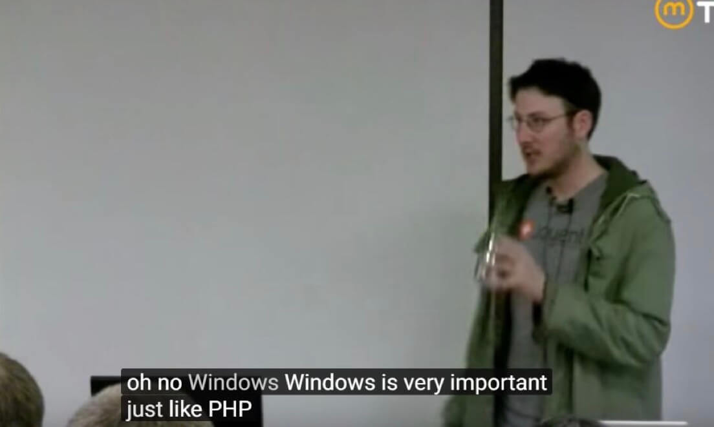
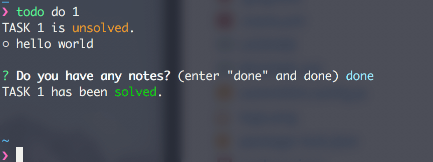

<br>
<div align="center" height="500">

</div>

<br><br><br>

### todo-live

> a todo list manager in  command line.

`todo-live` helps you build a simple list of tasks, you can change the state of the task and add notes. For developers, dealing with a task in a command line can help you to focus your attention.

support macOS / Linux / Windows?. 

(but i didn't test this on windows, i guess it might support.🤔)


### Install

`todo-live` required NodeJS. use npm installation:

```
npm i -g todo-live
```

### Usage

- **use alias (optional)** `alias t='todo'`

- **add a task (add / a)** `todo add` / `todo a`

  1. you can set up the expiration time, the default unit is hourly

      but you can still enter it like this:

      `input "1 / 5m / 2d / 20.5m" => 1 hour / 5 minutes / 2 days / 20.5 minutes`

  2. you can add bash script in details, just like: `bash[]`

      the code will be executed at your specified time.

      e.g. `bash[open https://www.google.com]`

      

- **task timeout notify**

  if the task includes a time setting, you'll get a notice when the task is out of time.

  

- **show tasks (show / s)** `todo show` / `todo show {index}` / `todo s`

  <details>
    <summary><b>preview</b> </summary>
    
    
  </details>

- **solve a task, you can also take notes (do / d)** `todo do {index}`
  <details>
    <summary><b>preview</b> </summary>
    
  </details>

- **remove a task (rm / r)** `todo rm {index}`

- **show task histroy** `todo log`

### About
if you have any ideas and suggestions, please tell me [here](https://github.com/DhyanaChina/todo-live/issues/new).
  
### LICENSE
**MIT**
  
