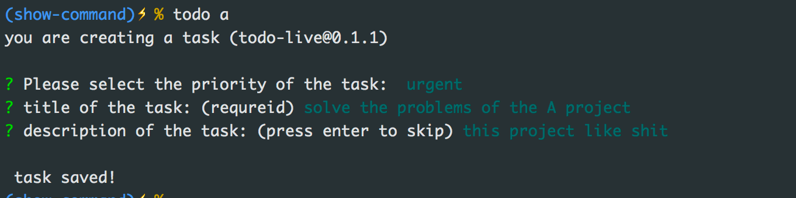
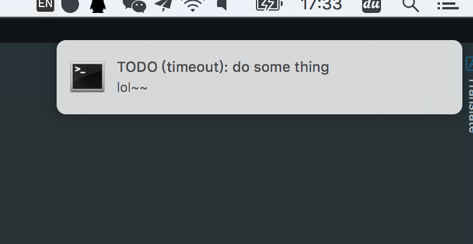
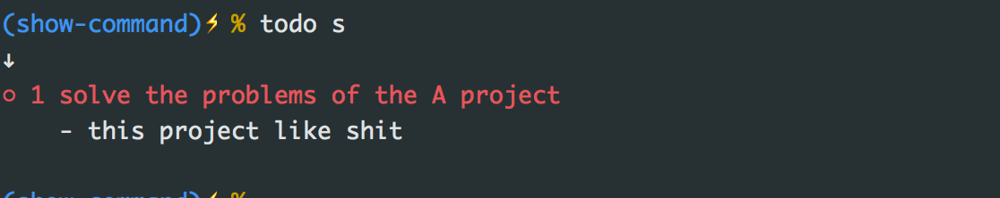
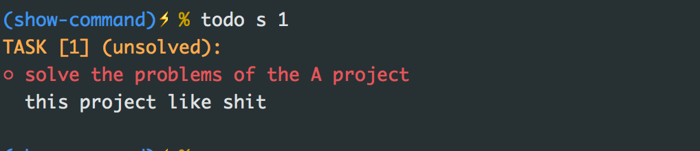
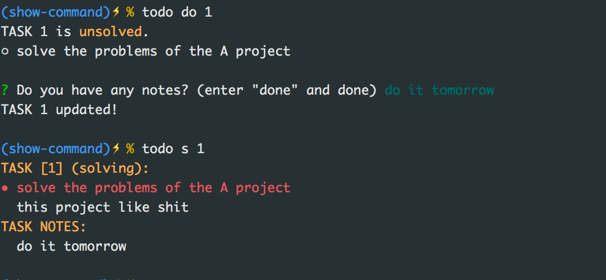
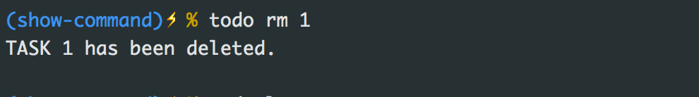
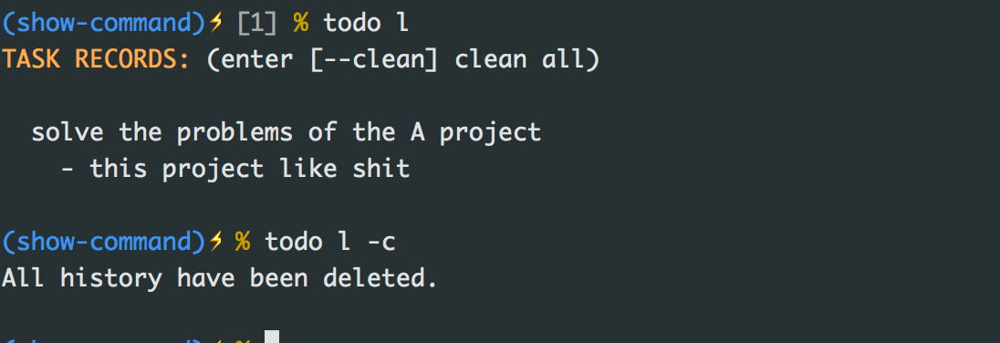

<br>
<div align="center" height="500">

</div>

<br><br><br>

### todo-live

> a todo list manager in  command line.

`todo-live` helps you build a simple list of tasks, you can change the state of the task and add notes. For developers, dealing with a task in a command line can help you to focus your attention.

### Install

`todo-live` required NodeJS. use npm installation:

```
npm i -g todo-live
```

### Usage

- use alias (optional)

  `alias t='todo'`

- add a task (add / a)

  `todo add` / `todo a`

  

- task timeout notify

  if the task includes a time setting, you'll get a notice when the task is out of time.

  

- show tasks (show / s)

  `todo show` / `todo show {index}` / `todo s`

  <details>
    <summary><b>preview</b> </summary>
    
    
  </details>

- solve a task, you can also take notes.

  `todo do {index}`
  <details>
    <summary><b>preview</b> </summary>
    
  </details>

- remove a task

  `todo rm {index}`

  <details>
    <summary><b>preview</b> </summary>
    
  </details>
  
- show task histroy

  `todo log`

  <details>
    <summary><b>preview</b> </summary>
    
  </details>
  
### About
if you have any ideas and suggestions, please tell me [here](https://github.com/DhyanaChina/todo-live/issues/new).
  
### LICENSE
**MIT**
  
